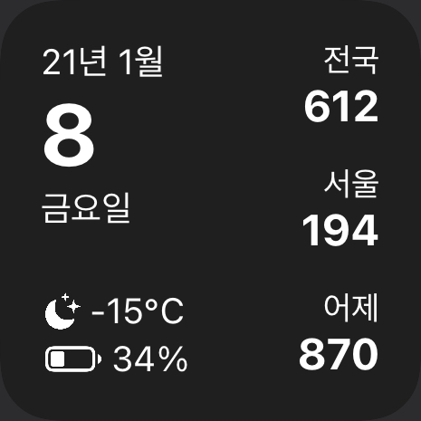
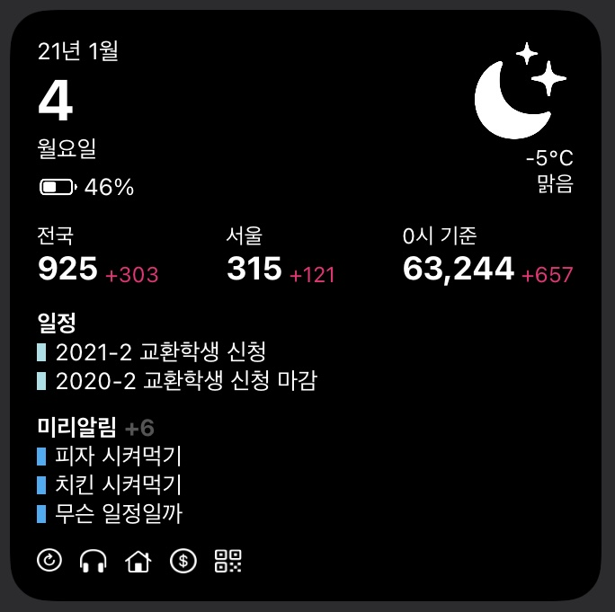
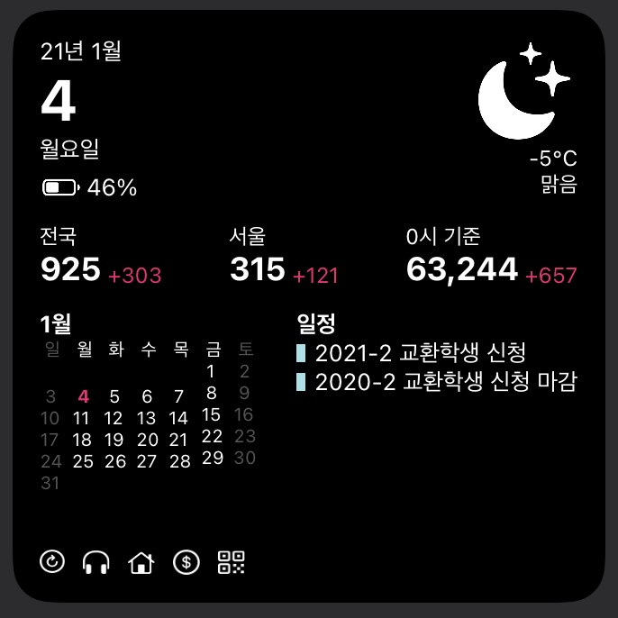
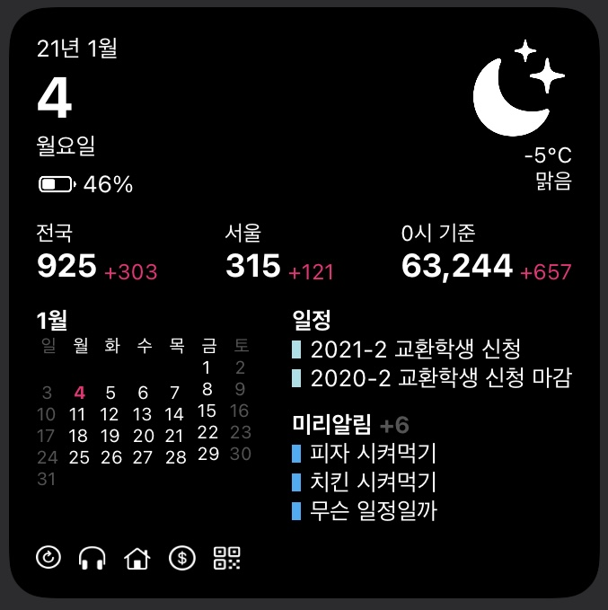
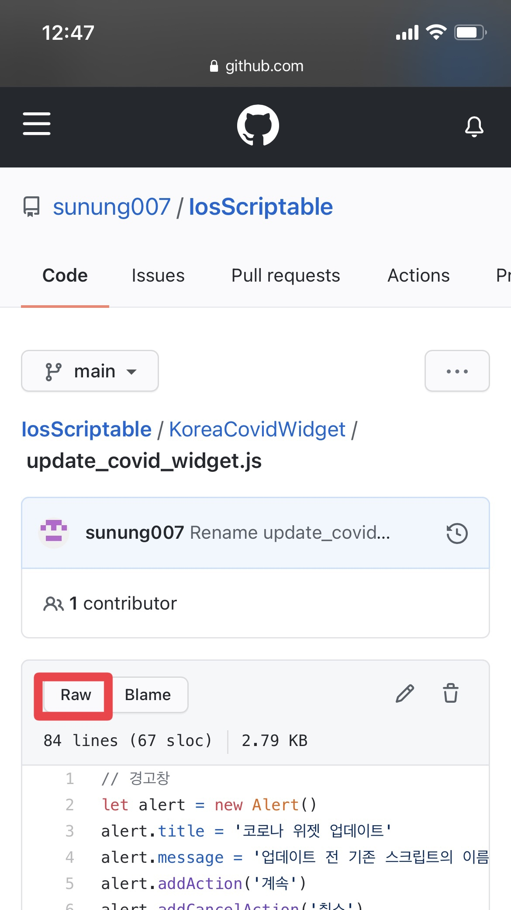
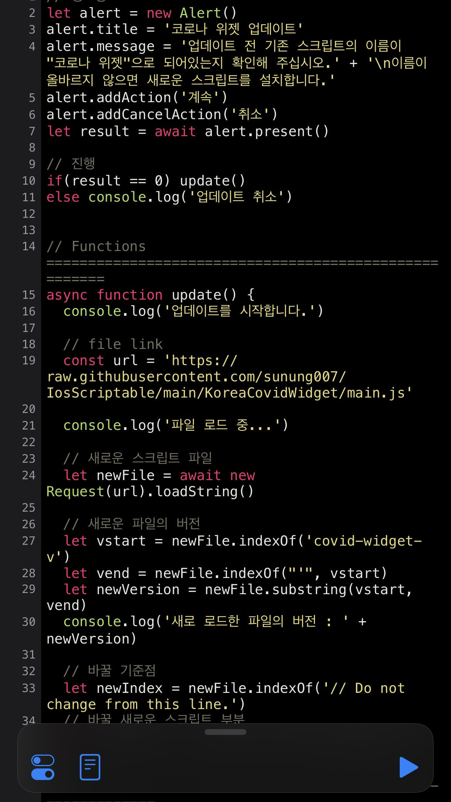
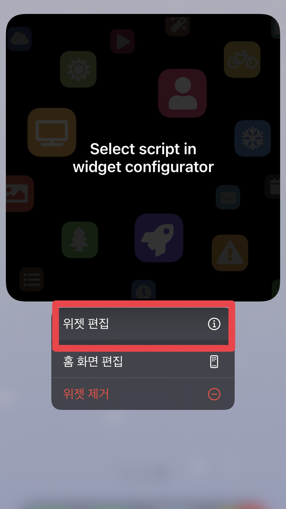
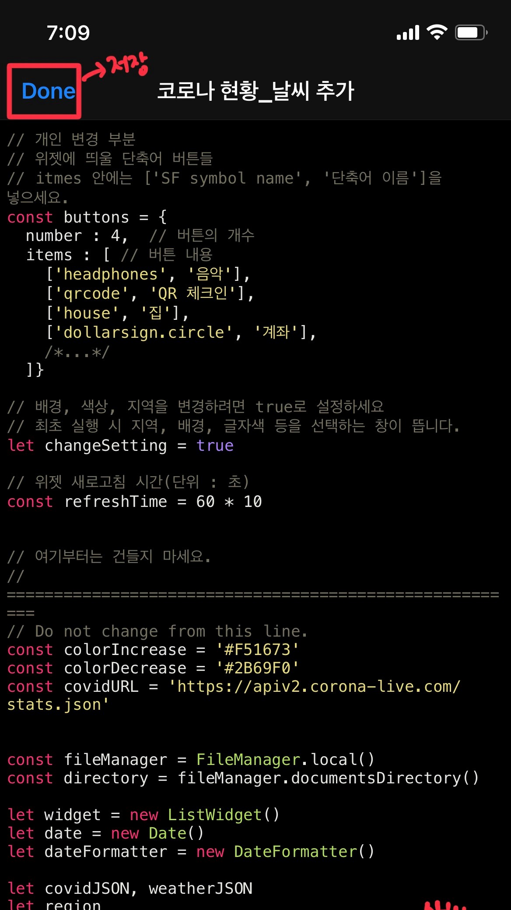
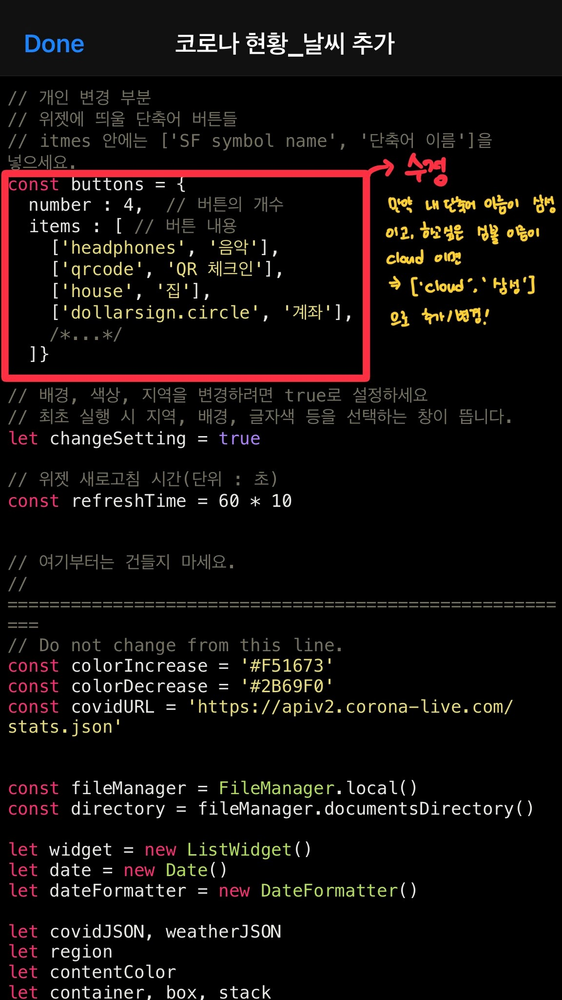

위젯 : 코로나 위젯
===================================================================================================
## 목차
- [소개](https://github.com/sunung007/IosScriptable/blob/main/KoreaCovidWidget/README.md#소개)
- [기본 구성](https://github.com/sunung007/IosScriptable/blob/main/KoreaCovidWidget/README.md#기본-구성)
   
- [위젯 설치 및 적용 방법](https://github.com/sunung007/IosScriptable/blob/main/KoreaCovidWidget/README.md#위젯-설치-및-적용-방법)
- [업데이트 방법](https://github.com/sunung007/IosScriptable/blob/main/KoreaCovidWidget/README.md#%EC%97%85%EB%8D%B0%EC%9D%B4%ED%8A%B8-%EB%B0%A9%EB%B2%95)
   
- [위젯 설정 변경, 단축어 설정](https://github.com/sunung007/IosScriptable/blob/main/KoreaCovidWidget/README.md#설정값-변경-방법)
   
- [오류 대처](https://github.com/sunung007/IosScriptable/blob/main/KoreaCovidWidget/README.md#FAQ)
- [자주묻는 질문](https://github.com/sunung007/IosScriptable/blob/main/KoreaCovidWidget/README.md#FAQ)

---------------

## 소개

iOS의 **Scriptable** 어플의 midium size와 large size의 위젯에서 작동하는 코드입니다.   

### 한눈에 보기
</img>   
### 작은 사이즈 위젯   
</img>   
### 중간 사이즈 위젯
</img>   
### 큰 사이즈 위젯
</img>
</img>
</img>

------------------------

## 기본 구성

### 위젯의 좌측부

- 날짜
  - 누르면 캘린더로 연결됩니다.
- 현재 날씨
  - 누르면 네이버 날씨로 연결됩니다.
- 배터리 용량
- 기능을 수행하는 버튼들
  - 각 버튼들은 단축어 어플과 연동되어 있습니다.
  - 단, 개인별로 단축어 이름이 다르기 때문에, 이 기능을 수행하기 전에 **코드를 직접 수정**해야 합니다.

### 위젯의 우측부
- 코로나 실시간 현황
- 전국단위 실시간 발생 현황
  - 금일 확진자 현황
  - 전일 대비 증감 수
- 특정 지역 실시간 발생 현황
  - 금일 확진자 현황
  - 전일 대비 증감
- 코로나 누적 확진자 수(정부 발표 기준)
  - 전국 누적 확진자 수
  - 전일 증가 수

### 위젯의 하단부
- 캘린더
  - 큰 사이즈 위젯을 선택했을 경우만 나타납니다.
  - 달력
    - 사용자가 On/Off할 수 있습니다.
  - 캘린더/리마인더 일정
    - 사용자가 선택할 수 있습니다.
    - 둘 중 하나는 반드시 보여야 합니다.
    - 캘린더 일정의 경우 [오늘, 이번주, 이번달] 일정 중 선택할 수 있습니다.
- 버튼
  - url scheme을 이용하여 단축어, 어플 등으로 직접 연결할 수 있습니다.   
  

전국과 특정 1개 지역의 실시간 현황과 누적 현황을 나타냅니다.    

----------------

## 위젯 설치 및 적용 방법

아래 방법 1과 방법 2 중 편하신 방법을 이용하세요.    
초심자들에게는 **방법 1**을 추천합니다.   
※ 기기에 **scriptable** 어플이 설치되어 있어야합니다. [여기](https://apps.apple.com/kr/app/scriptable/id1405459188)를 누르면 앱스토어로 이동합니다.

### 방법 1. 업데이트 파일 이용하기(설치 가능)
1. [코드 페이지](https://github.com/sunung007/IosScriptable/blob/main/KoreaCovidWidget/update_covid_widget.js)로 들어갑니다.
2. RAW를 눌러 전체 코드를 복사합니다.
3. scriptable 어플을 실행합니다.   
4. `+`버튼을 눌러서 코드를 붙여넣습니다.    
5. 화면 우측 하단의 재생 버튼을 눌러 코드를 실행시킨 후, 좌측 상단의 `DONE`을 눌러 저장합니다.
6. 새로 생성된 코로나 위젯을 눌러 실행합니다.
7. 바탕화면에 scriptable 위젯을 생성한 후 위젯 편집에 들어가서 script를 **코로나 위젯**으로 지정합니다.   
</img>
</img>
</img>
</img>
</img>
</img>
</img>

### 방법 2. 코드 복사하기
1. [코드 페이지](https://github.com/sunung007/IosScriptable/blob/main/KoreaCovidWidget)에 들어갑니다.  
2. **RAW** 버튼을 눌러 전체 코드를 복사합니다.   
3. scriptable 어플을 실행합니다.   
4. `+`버튼을 눌러서 코드를 붙여넣습니다.   
5. 우측 하단의 재생 버튼을 눌러서 코드를 실행시킨 후 왼쪽 상단의 `Done`을 눌러 적용합니다.   
6. scriptable 위젯을 추가하고, 위젯 편집에 들어가 script를 방금 추가시킨 것으로 선택합니다.   

</img>
</img>
</img>
</img>

--------------------
## 업데이트 방법
### 업데이트 파일을 이용하면 어떤 점이 좋나요?
업데이트 파일을 이용하면 더이상 긴 코드를 복사/붙여넣기 하지 않아도 됩니다!   
기존의 버튼에 관한 설정 내용이 그대로 유지됩니다.   
### 업데이트 방법
**※ 업데이트 전 위젯 script의 이름이 "코로나 위젯"으로 되어있는지 확인하세요**   
업데이트 script를 통해 설치하셨다면 자동으로 script의 이름이 "코로나 위젯"으로 설정됩니다.   
처음 위젯 설치 시 추가했던 '업데이트' 코드를 실행시키기만 하면 됩니다.   
만약 업데이트 script를 삭제했다면, [코드 페이지](https://github.com/sunung007/IosScriptable/blob/main/KoreaCovidWidget/update_covid_widget.js)에서 코드를 복사하여 업데이트 script를 다시 추가하십시오.

------------------
## 설정값 변경 방법
### 위젯 설정 변경
배경, 글자색, 위젯 사이즈 등 위젯에 대한 대부분의 설정을 변경할 수 있습니다.   
코드를 편집해야 합니다.   
1. 코드 16번째 줄의 `let changeSetting = false`의 값을 `true`로 변경합니다.
2. 재생버튼을 눌러 script를 실행시킵니다.
3. 실행이 끝나면 `changeSetting`을 `false`로 변경합니다.
4. Done을 눌러 저장합니다.

### 새로고침 시간 변경
코드를 편집해야 합니다.
1. 19번째 줄의 `const refreshTime = 60 * 10`의 값을 변경합니다.
2. 단위는 초입니다.
3. 기본 상태의 새로고침 시간은 10분 입니다.
4. Done을 눌러 저장합니다.

### 위젯 버튼들 수정하기
코드를 수정해야 합니다.
1. 넣고 싶은 버튼의 개수를 `number`에 입력합니다.   
  아래 버튼들을 많이 적어놔도 `number`의 값이 작으면 이에 맞춰서 버튼이 생성됩니다.   
   `number = {버튼 개수}`   
2. items의 내용에 SF symbol 이름과 기기에 저장된 단축어 이름이나 url scheme을 입력합니다.   
   `['{SF Symbold 이름}', '{단축어 이름 혹은 어플 URL scheme}'],`
3. URL scheme을 이용하기 때문에 단축어 이름은 띄어쓰기, 대/소문자 까지 정확해야 합니다.
4. SF symbol은 [여기](https://github.com/cyanzhong/sf-symbols-online)서 확인할 수 있습니다.
5. 예시 : 'cloud' 이미지를 버튼으로 하고 '업데이트'라는 단축어를 실행시키기
     - `number`를 5로 바꾼 후
     - `items` 안에 `/*...*/`의 부분에 `['cloud', '업데이트'],`을 추가합니다.
     - 추가할 때 컴마(,)를 잊지 마세요!   
```
// 위젯에 띄울 단축어 버튼들
// itmes 안에는 ['SF symbol name', '단축어 이름 혹은 url scheme']을 넣으세요.
const buttons = {
  number : 4,  // 버튼의 개수
  items : [ // 버튼 내용
    ['headphones', '음악'],
    ['qrcode', 'QR 체크인'],
    ['house', '집'],
    ['dollarsign.circle', '계좌'],
    /*...*/
  ]} 
```
**이제는 단축어 뿐만 아니라 모든 어플의 url scheme도 지원합니다!**   
(단, 해당 url의 끝에는 `://` 형식으로 끝나야 합니다.)   
※ 코드 위치 참고   
</img>   

### 글자 크기 조절 방법
코드의 내용을 수정해야합니다.   
수정 부분은 개인 변경 부분의 하단부에 위치합니다.  
1. 기본 코드 내용
```
const fontSizeExtraSmall = 12
const fontSizeSmall = 13
const fontSizeMedium = 16
const fontSizeLarge = 18
const fontSizeData = 32
const fontSizeMonthly = 10
```
2. 코드 상세 설명
- `fontSizeExtraSmall`
  - 코로나 현황의 카테코리 이름을 나타냅니다.(전국, 지역명 등)
  - 중간 크기와 큰 크기의 위젯에서 증감 수를 나타냅니다.(+/- 수)
  - 큰 사이즈에서의 날씨 온도와 상태를 나타냅니다.
- `fontSizeSmall`
  - 날짜의 년, 월, 요일을 나타냅니다.
  - 배터리 정보를 나타냅니다.
  - 중간 크기에서의 날씨 온도를 나타냅니다.
  - 큰 크기 달력에서의 월을 나타냅니다.
- `fontSizeMedium`
  - 작은 크기에서의 코로나 정보를 나타냅니다.
- `fontSizeLarge`
  - 중간 크기와 큰 크기의 코로나 정보 중 발생 수를 나타냅니다.(몇명인지)
- `fontSizeDate`
  - 날짜의 일(day)을 나타냅니다.
- `fontSizeMonthly`
  - 큰 크기 달력을 나타냅니다.

### 글꼴 변경 방법
설정 전 반드시 **글꼴 프로파일이 설치되어있어야 합니다.**
1. 코드
```
// 글꼴 : 프로파일 이름과 정확히 일치해야합니다.
// 프로파일 : 설정 > 일반 > 프로파일
const font = 'NanumSquare_ac Regular'
const boldFont = 'NanumSquare ExtraBold'
```
2. 코드 상세 설명
- `font` : 주로 사용될 폰트의 프로파일명을 넣으세요.
- `boldFont` : **굵은** 글씨에 사용될 폰트의 프로파일명을 넣으세요.
- 프로파일 이름 확인방법 : 설정 > 일반 > 

---------------
## FAQ
### 버튼 내용 추가/삭제/변경
[여기](https://github.com/sunung007/IosScriptable/blob/main/KoreaCovidWidget/README.md#위젯-버튼들-수정하기)에서 확인하세요.

### 글자 크기 조절
[여기](https://github.com/sunung007/IosScriptable/blob/main/KoreaCovidWidget/README.md#글자-크기-조절-방법)에서 확인하세요.

### 폰트 설정 및 변경
[여기](https://github.com/sunung007/IosScriptable/blob/main/KoreaCovidWidget/README.md#글꼴-변경-방법)에서 확인하세요.

### 오류 : Select script in widget configurator
위젯 편집에 들어가셔서 **script-저장한 스크립트 선택** 하면 됩니다.

### 오류 : SyntaxError : ~~~
끝까지 복사 안하신 경우가 거의입니다. 코드가 너무 길어서 그래요ㅠㅠ   
코드를 **끝까지 복사** 하시고 처음부터 다시 진행해주세요.   
그래서 코드 복사/붙여넣기가 아닌 업데이트 파일을 통한 설치를 권장합니다!   

### 오류 : Alerts are not supported in a widget.
코드 16번째 줄의 `changeSetting`을 `false`로 변경하시고 스크립트 실행-적용 해주세요.

----------------------

업데이트 내용
-------------

> 20.12.29 10:07 주석

> 20.12.30 19:57
  >> - 코드 구조 변경
  >> - 위젯 설정 변경 시 `changeSetting` 값만 바꾸도록 변경
  >> - 위젯 설정 시 alert 띄워서 진행
  >> - 날씨 위젯 추가

참조
----

- 본 위젯의 현황 데이터는 [corona-live.com](http://corona-live.com)를 이용하였습니다.   
- 본 위젯의 기상 데이터는 기상청 오픈 API를 이용하였습니다.    
- 본 위젯의 투명 배경 소스는 [mzeryck님의 배경화면 자르는 스크립트](https://gist.github.com/mzeryck/3a97ccd1e059b3afa3c6666d27a496c9)를 이용했습니다.   
